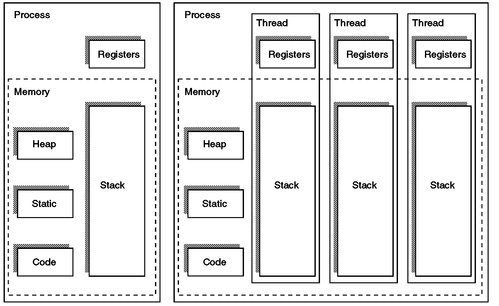

# 스레드

프로세스에서 실행 가능한 가장 작은 단위. 하나의 프로세스는 여러 스레드를 가질 수 있다. 스레드들은 프로세스의 자원을 공유한다.

**스레드를 사용하는 이유**
같은 연산을 여러개 해야할 때 각각의 연산을 독립적인 프로세스로 실행 하게 되면, 각 프로세스마다 독립적인 메모리를 차지하게 되어 메모리의 낭비가 발생한다. 하지만 스레드를 사용하게 되면 하나의 프로세스 내에서 여러 스레드가 같은 연산을 수행하기 때문에 하나의 메모리 영역에서 모든 연산을 처리할 수 있으므로, 메모리의 낭비가 없어진다.

프로세스는 독립적인 하나의 메모리 영역을 가지고 다른 프로세스와 공유하려면 IPC(Inter-Process Communication) 을 사용해야 하는데 이는 오버헤드가 크다. 따라서 프로세스를 여러개 생성하여 연산을 하는 것보다, 하나의 프로세스 안에서 여러개의 스레드가 컨텍스트 스위치를 하는 것이 메모리 측면과 성능 측면에서 효율적이다.

위의 그림에서 볼 수 있듯이 스레드에는 다른 스레드와 공유하지 않는 부분도 존재한다. 스레드도 하나의 프로세스 내에서 실행되기 때문에 스레드마다 어디까지 작업이 진행되었는지에 필요한 프로그램 카운터(PC), 레지스터 정보와 스택 영역이 있다. 이 부분을 **스레드 제어 블록**(TCB, Thread Control Block)이라고 한다. 스레드들끼리 공유하는 프로세스의 영역은 힙(Heap), 데이터(Data), 코드(Code) 영역이다.

**스레드와 프로세스의 차이점** 
* **메모리 사용**: 프로세스는 독립적인 메모리 공간을 차지하고 작업을 수행하지만, 스레드는 프로세스의 메모리를 공유하여 사용하기 때문에 메모리 낭비가 줄어든다.
* **효율성**: 웹 서버가 프로세스 단위로 동작한다면, 복잡한 연산을 하는 동안 사용자는 다른 작업을 할 수 없지만, 스레드를 사용하면 하나의 스레드가 연산을 하고, 다른 스레드가 사용자의 요청을 받을 수 있어 성능과 효율이 올라간다.
