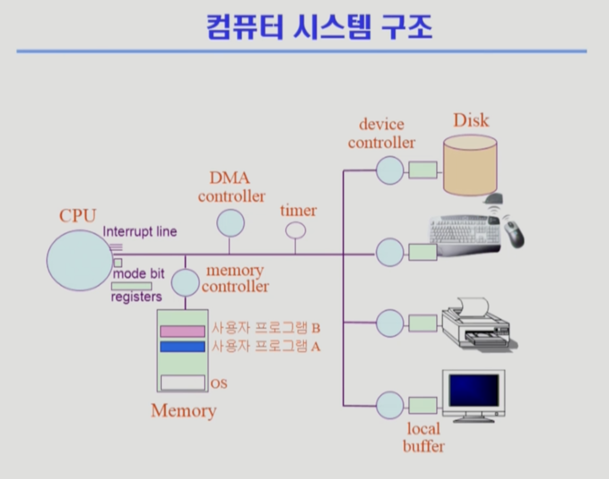

# 컴퓨터 시스템 구조

컴퓨터 시스템의 구조는 위의 사진과 같다.

- **CPU** : 메모리에 올라가있는 명령어들을 실행한다.

- **메모리** : 디스크에 있는 프로그램을 메모리에 적재함으로써 프로세스가 되며, 이를 CPU 가 실행한다.

- **커널** : 운영체제에서 핵심적인 기능들을 모아둔 것을 커널이라고 한다. 커널은 디스크에 있는 프로그램을 메모리에 적재하는 작업 등을 담당한다. 또한, 프로세스 관리, 메모리 관리, 파일 시스템, 디바이스 제어 등을 수행한다.

- **DMA 컨트롤러** : I/O 디바이스가 메모리에 직접 접근할 수 있게 해주는 하드웨어 장치. CPU에게 오는 인터럽트를 분산 시켜 부하를 줄인다. 하나의 작업을 CPU와 DMA 컨트롤러가 동시에 하는 것을 방지한다.

- **타이머** : CPU를 사용하는 작업에는 시간 제한을 두어, 주어진 시간이 끝나면 **인터럽트**를 발생시켜 CPU를 반납하고 CPU 큐에서 다시 CPU를 할당받도록 한다. 이 방식은 작업이 너무 오랫동안 CPU를 점유하지 못하게 하여, 시스템의 공평성과 반응성을 보장한다. 타이머가 없이 CPU를 사용하는 방식인 FCFS(First Come, First Served)는 긴 작업이 CPU를 오랫동안 점유하게 되어, 뒤따르는 짧은 작업들이 불필요하게 오래 기다리게 되는 **콘보이 현상**을 일으킬 수 있다. 따라서 현대의 운영체제는 타이머를 설정하여 시간을 분할하고, 각 작업이 일정 시간 동안만 CPU를 사용하도록 하는 **Round Robin** 방식을 주로 채택하고 있다.

- **디바이스 컨트롤러** : 컴퓨터와 연결되어 있는 I/O 디바이스들의 작은 CPU를 말하고 옆에 붙어 있는 로컬 버퍼는 각 디바이스에서 데이터를 임시로 저장하기 위한 작은 메모리를 뜻한다.

- **Mode bit** :  modebit 은 CPU의 실행 모드를 구분 짓는 비트이다. 
  - 커널모드 0 : 특권명령을 포함한 모든 명령을 실행할 수 있는 모드
  - 사용자모드 1 : 제한된 명령어만 실행할 수 있으며, 특권명령의 실행은 금지된다. 특권명령을 실행시키려면 **시스템콜**을 호출하여 실행모드를 사용자모드에서 커널모드로 변경하여야 한다.

- **시스템콜** :  사용자 프로그램이 운영체제의 커널 기능과 서비스에 접근하기 위해 사용하는 인터페이스.

- **프로세스와 프로그램** : 디스크에 저장된 프로그램은 실행되지 않은 상태이며, 이를 메모리에 적재하여 실행하게 되면 프로세스가 된다. 프로세스는 실행 중인 프로그램을 의미한다.

- **인터럽트** : CPU의 현재 작업을 중단하고 운영체제가 정의한 인터럽트 처리 루틴을 실행하게 하는 신호. 인터럽트는 하드웨어 인터럽트와 소프트웨어 인터럽트로 나뉜다.
  - 하드웨어 인터럽트 : I/O 컨트롤러나, 타이머가 발생하는 인터럽트
  - 소프트웨어 인터럽트(Trap) : 소프트웨어가 발생하는 인터럽트. 시스템 콜도 소프트웨어 인터럽트의 한 형태.