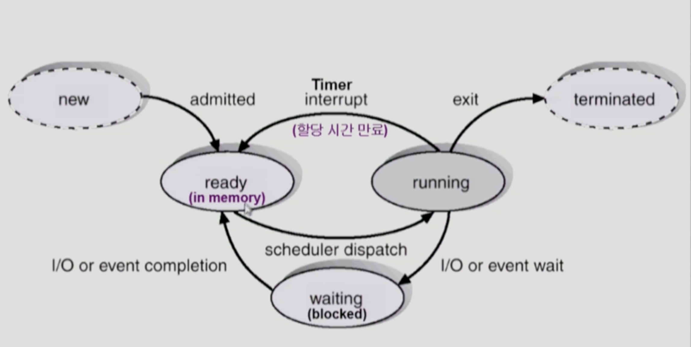

# 프로세스

프로세스 : 디스크에 있는 프로그램이 메모리에 적재되어 실행중인 상태. CPU 스케줄링의 대상이 되는 작업.

**프로세스의 문맥**
- CPU 수행 상태를 나타내는 하드웨어 문맥
  - PC(Program Counter), register
- 프로세스의 주소 공간
  - code, data, stack
- 프로세스 관련 커널 자료 구조
  - PCB(Process Control Block)
  - 커널 스택(Kernal stack)

**프로세스의 문맥이 필요한 이유**
- 운영체제는 효율적인 CPU 사용을 위하여 여러개의 프로세스들이 번갈아가며 CPU를 사용한다(컨텍스트 스위칭). 
- 따라서 CPU를 반납하고 재할당받아 작업을 수행하는 과정에서 이전에 어디까지 작업이 진행되었는지, 어떤 상태였는지에 대한 문맥 정보가 없다면 컨텍스트 스위칭이 어렵다.
- 현재 수행중인 프로그램의 수가 n개라면, 커널 스택은 n만큼 독립적인 공간을 둔다.
  - 프로세스는 실행 과정에서 CPU의 레지스터에 데이터를 R/W 작업을 수행하고, CPU의 PC는 프로세스의 코드 영역을 가리키며 명령어를 수행한다.
  - 인터럽트가 발생한다면 CPU는 레지스터를 비우고 커널 영역의 작업을 수행하여야 한다. 이때 이전의 프로세스 상태를 기억하기 위해서 커널 스택에 프로세스 별로 독립적인 PCB를 저장하여 이전의 상태를 기억한다.

**PCB**
- 운영체제가 각 프로세스를 관리하기 위해 프로세스 당 유지하는 정보
  - OS가 관리상 사용하는 정보
    - 프로세스 ID, 프로세스 상태, 스케줄링 정보, 우선순위
  - CPU 수행 관련 하드웨어 값
    - PC(Program Counter), registers
  - 메모리 관련
    - code, data, stack
  - 파일 관련
    - 프로세스가 접근하고 있던 파일정보

**프로세스의 상태**

- 실행(Running)
  - CPU를 할당 instruction을 수행중인 상태
- 준비(Ready)
  - CPU를 할당받으면 당장 명령을 수행할 수 있는 상태. CPU 할당 대기 중인 상태
- 대기(Blocked(wait, sleep))
  - CPU를 할당받더라도 당장 instruction을 수행할 수 없는 상태
  - 프로세스가 요청한 I/O 작업이 진행 중인 경우 CPU를 할당받더라도 I/O 작업이 끝나기 전까지 instruction을 수행할 수 없기 때문에 CPU를 할당하지 않는다.
- New : 프로세스가 생성 중인 상태
- Terminated : 수행이 끝난 상태

준비 상태의 프로세스가 실행 상태로 변경되는 경우는 실행 중이던 프로세스가 I/O 작업을 하거나, CPU 할당 시간이 만료되어 타이머 인터럽트가 발생한 경우이다.

OS는 준비 상태에 있는 프로세스들을 순차적으로 CPU를 할당하기 위해 준비 큐를 두고 CPU를 할당한다. 준비 큐에 줄을 세우는 방법은 CPU 스케줄링 방법에 따라 달라진다.

OS는 자원 별로 준비 큐를 두고 관리를 한다. I/O 장치를 예로 들면 모든 I/O 장치는 독립적인 준비 큐를 두고 있고, 프로세스는 해당 장치의 준비 큐에서 순서를 기다리게 된다. 그리고 작업이 완료되면 I/O 장치는 인터럽트를 발생시키고, **인터럽트 처리 루틴**에 의해 디스크 입출력이 완료된 프로세스는 I/O 준비 큐에서 CPU 준비 큐로 오고 CPU 할당을 기다리게 된다.

**인터럽트 처리 루틴**
인터럽트 처리 루틴 : 인터럽트가 발생하였을 때 CPU가 해야하는 일들을 미리 정의해둔 코드 블록이다.
인터럽트 벡터 : 인터럽트 종류마다 번호를 정해서, 번호에 따라 처리해야하는 코드가 있는 위치를 포인터로 가리키고 있는 자료구조이다.

인터럽트가 발생하면 CPU는 현재 실행 중인 프로세스를 중단하고, 프로세스 문맥을 PCB에 저장한다. CPU는 인터럽트 벡터가 가리키는 곳으로 가서 정의되어있는 커널 코드를 수행하게 된다. 인터럽트 처리 루틴이 끝나면 PCB에 있는 정보를 CPU에 불러오고 실행 중이던 프로세스의 명령어를 다시 수행한다.

이렇게 프로세스가 중단되고 다시 실행되는 과정을 컨텍스트 스위칭이라고 한다.
