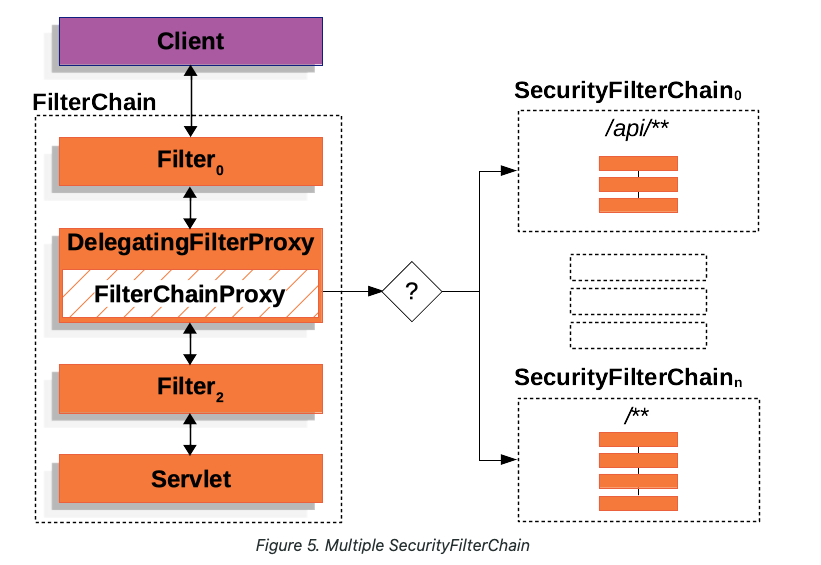
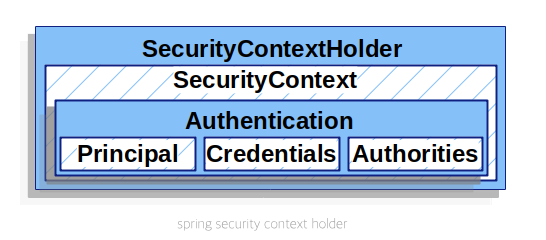

# 스프링 시큐리티 아키텍쳐
스프링 시큐리티의 동작 과정의 흐름

## DelegatingFilterProxy
보안과 관련된 인증 처리는 스프링 컨테이너로 오기 전 서블릿 필터에서 이루어진다.
스프링부트를 사용하면 자동으로 스프링은 서블릿 컨테이너의 필터에 DelegatingFilterProxy를 등록해준다. 이름에서 알 수 있듯이 인증처리를 위임하는 역할을 한다.  

DelegatingFilterProxy는 ApplicationContext에서 FilterChainProxy를 찾아서 요청에 대한 인증을 처리한다.

## FilterChainProxy
FilterChainProxy는 DelegatingFilterProxy가 인증을 처리할 때 사용하는 객체로 스프링 빈으로 등록되어 있다. FilterChainProxy는 내부에 스프링 빈으로 등록된 SecurityFilterChain을 가지고 있는데 이는 chain 형태로 인증을 처리하는 다수의 filter들로 구성되어 있다. FilterChainProxy는 인증을 처리할 때 SecurityFilterChain을 거치면서 인증을 처리한다. 스프링 시큐리티를 사용하면서 문제가 발생한다면 FilterChainProxy에서 문제점을 찾는 것이 바람직하다.

## SecurityFilterChain
사용자의 요청에 대한 인증 및 인가를 처리하기 위한 필터들의 chain이다. SecurityFilterChain에 속해있는 filter들은 처리하는 요청들이 각각 다르고 인증 및 인가를 처리할 때 AuthenticationManager, AuthorizationManager를 사용하여 인증과 인가를 처리한다. 다음은 요청을 처리하는 filter들의 순서이다.

### 1. WebAsyncManagerIntegrationFilter

Security Context 는 Local Thread를 사용하여 스레드마다 고유한 저장공간에 Authentication(인증정보)를 저장하여 요청을 처리하게 된다. 스프링 프레임워크는 스레드 풀을 사용하여 다수의 스레드들이 요청을 처리하게 되는데, 각각의 스레드는 자신의 Local Thread를 사용하기 때문에 비동기적인 요청에 대한 처리는 할 수 없다. 하지만 WebAsyncManagerIntegrationFilter가 SecurityContextHolder의 전략에 맞게 SecurityContext를 통합해주는 역할을 한다. SecurityContextHolder란 SecurityContext를 가지고 있는 객체이다. 

요약하면 비동기처리를 할 수 있도록 도와주는 filter이다.

### 2. SecurityContextPersistenceFilter (세션을 사용할 경우)

스프링 시큐리티에서 요청을 처리할 때 Authentication을 사용하여 처리하는데, 만약 인증된 사용자에 대한 정보가 세션에 있다면 해당 요청은 다시 인증과정을 거칠 필요가 없다. 요청이 해당 필터에 들어오게 되면 SecurityContextPersistenceFilter는 내부에 있는 SecurityContextRepository를 조회하여 세션ID와 일치하는 인증정보가 있는지 확인한다.
SecurityContextRepository는 인터페이스로 여러가지의 구현체가 있는데 그 중에서 세션을 사용할 경우에는 HttpSessionSecurityContextRepository를 사용하게 된다. HttpSessionSecurityContextRepository는 세션에 있는 인증정보를 가져와 요청을 수행할 스레드의 Security Context에 저장한다. 해당 스레드는 요청을 처리하는 과정에서 다른 스레드와 해당 정보를 공유하지 않는다. 요청을 모두 처리하게 되면 Local Thread에 있는 인증정보를 세션에 갱신하고 스레드의 Local Thread를 비운다.

이 필터의 우선순위가 높은 이유는 만약 들어온 요청이 인증이 필요한 요청이라면 남은 필터들을 거치면서 인증처리를 해야하지만 이미 인증이 된 요청이라면 남아있는 필터들을 거칠 필요가 없기 때문에 우선순위가 높은 것이다.
JWT는 상태를 서버측에서 저장할 필요가 없는 stateless 인증이기 때문에 SecurityFilterChain에 sessionManagement 설정을 통하여 해당 필터를 비활성화 시켜줄 수 있다.

### 3. HeaderWriterFilter

Response Header에 시큐리티 관련 Header를 추가해주는 Filter이다. 내부에 Header를 추가해주는 HeaderWriter의 List를 가지고 있으며 이를 사용해서 설정에 맞게 Header에 정보를  작성한다. 

- X-content-type-Options 
  
  X-Content-Type-Options: nosniff 
  Header에 명시된 컨텐츠 타입으로만 데이터를 처리한다. Header에 명시된 데이터 타입으로만 처리를 하며 추론하는 행위를 하지 않는다.

- X-xss-protection

  XSS(크로스 사이트 스크립팅) 공격을 방어하는 Header 
  

- Cache-control

  캐시 히스토리 취약점을 방어하는 Header 
  정적인 페이지가 아니라면 민감정보가 노출될 수 있으므로 캐시를 설정하지 않는다.

- HSTS

  HTTPS로만 통신을 강제하는 Header 
  공격자가 사용자와 서버 사이의 통신을 가로채 정보를 도청하거나 변조하는 것을 방지한다. 예를 들어, 공격자가 네트워크 트래픽을 가로채어 사용자를 가짜 페이지로 리다이렉트하는 것을 방지할 수 있다.

- X-frame-options

  clickjacking(클릭재킹) 공격을 방어하는 Header 
  공격자가 만든 웹사이트에 투명한 iframe에 다른 사이트를 불러와서 그 위에 다른 요소들을 배치함으로써 사용자의 클릭을 유도하여 공격을 하는 행위이다. 나의 서버의 웹사이트를 다른 사이트의 iframe안에 불러오는 것을 막을 수 있다. 

  스프링 시큐리티와 H2 데이터베이스를 console로 사용하게 된다면 기본적으로 X-frame-Options Header가 설정되어 있다. h2-console에 대한 경로로 접근하면 화면이 정상적으로 출력이 되지 않는데 H2를 콘솔해서 사용하는 것은 iframe 태그 내에 데이터베이스를 조작할 수 있는 스크립트가 있기 때문에 X-frame-Options를 설정하지 않으면 정상적으로 동작하지 않게 되는 원리이다.

### 4. CsfrFilter
CSRF 공격을 방지하는 Filter 

인증된 유저의 계정을 사용해 인증된 서버에 악의적인 요청을 발생시키는 공격. 보통은 같은 도메인에서 오는 요청만 처리하도록 CORS 설정을 하면 예방이 되지만 REST API를 만들다보면 다른 도메인에서의 요청도 허용해주어야 하는 상황이 발생한다. 
Form 인증을 하는 경우에 스프링 시큐리티는 인증 Form에 CSRF 토큰을 hidden으로 설정하여 보이지 않게 담아서 보내준다. 사용자는 CSRF 토큰의 존재는 모른채로 서버에 CSRF 토큰과 함께 요청을 보내게 되고 서버는 CSRF 토큰을 확인하고 요청을 처리한다.

### 5. LogoutFilter
로그아웃을 처리하는 Filter 
컴포짓 패턴이 적용되어 있으며 내부에 컴포짓 객체가 있고 여러개의 로그아웃을 처리하는 Handler를 사용하여 로그아웃을 처리한다. 들어온 요청이 로그아웃 요청인지를 판단하고 로그아웃을 처리하는 필터이다. LogoutSuccessHandler는 로그아웃이 완료되고 나서 다음 작업을 수행하는 Handler이다.

### 6. UsernamePasswordAuthenticationFilter
Form 로그인을 처리하는 필터 
사용자가 요청으로 아이디와 비밀번호와 함께 로그인요청을 서버에 보내게 되면 UsernamePasswordAuthenticationFilter가 이 요청을 처리하게 된다. 요청으로 들어온 아이디와 비밀번호를 가지고 authentication 을 생성한 뒤 AuthenticationManager에게 인증을 위임한다. AuthenticationManager의 기본구현체인 ProviderManager는 AuthenticationProvider 컬렉션을 가지고 이를 통해서 로그인을 처리하게 된다. 이 과정에서 UserDeatilsService의 loadUserByUsername가 중요한 역할을 한다. AuthenticationManager는 userDetailsService의 loadUserByUsername 메서드를 호출해 사용자의 비밀번호를 가져와 이를 매치시켜보고 맞다면 인증정보를 생성하여 SecurityContext에 저장하게 된다. 따라서 시큐리티로 폼 로그인을 구현한다면 userDetailsService의 loadUserByUsername을 필수적으로 구현하여야 한다.

### 7. DefaultLoginPageGeneratingFilter, DefaultLogoutPageGeneratingFilter

로그인, 로그아웃 시 필요한 기본 페이지를 만들어주는 필터 
커스텀한 로그인 페이지를 만들어서 사용한다면 두 필터는 필터체인에 등록되지 않는다.

### 8. BasicAuthenticationFilter

Basic 인증을 처리하는 필터 
요청을 보낼 때, HTTP 헤더의 Authorization: Basic {base64 인코딩} 부분에 사용자 이름과 비밀번호를 Base64로 인코딩하여 전송하는 방식을 Basic 인증이라고 한다. 이 방식은 세션을 사용하지 않는 무상태 인증 방식이며, JWT와 개념적으로 비슷하다. 그러나 Basic 인증은 Base64로 인코딩된 정보를 다시 디코딩하면 사용자의 정보가 쉽게 유출될 수 있어 보안상 취약점을 가진다. 이런 요청이 오면 BasicAuthenticationFilter는 헤더에서 사용자의 정보를 추출해 Authentication 객체를 생성하고, 이를 통해 사용자 인증을 처리한다.

### 9. RequestCacheAwareFilter

캐시된 요청이 있다면 그 요청을 처리하고, 없다면 현재 요청을 처리하는 필터

로그인을 하지 않은 상태에서 인증 정보가 필요한 경로에 접근하면, Spring Security는 권한이 없는 사용자를 로그인 페이지로 리다이렉트한다. 이 과정에서 원래 사용자가 접근하려던 요청은 캐시에 저장되고, 사용자는 로그인 페이지로 이동하게 된다. 로그인이 완료되면 RequestCacheAwareFilter는 캐시된 요청을 꺼내어 이를 처리하게 되는 구조이다.

### 10. ExceptionTranslationFilter

인증 과정 중 발생할 수 있는 예외를 처리하는 필터

AccessDeniedException(접근 거부), AuthenticationException(인증 실패) 과 같은 예외들이 발생했을 때, 이를 적절히 핸들링하여 사용자에게 알맞은 응답을 전송한다.

### 11. AnonymousAuthenticationFilter

익명 사용자에게 일시적인 인증을 제공하는 필터

인증되지 않은 사용자들에게도 일정한 접근 권한을 부여하여 익명 ID와 권한을 할당한다. 인증 정보가 요구되지 않는 자원에 접근할 수 있게 하기 위함이다.

## SecurityContextHolder, SecurityContext, Authentication

- **Authentication** 이란 Spring Security 가 HTTP 요청을 필터에서 처리한 뒤 생성된 해당 요청에 대한 인증 정보를 뜻한다.
- Authentication은 **SecurityContext**에 저장되어 있으며, FilterChainProxy는 메모리 누수를 방지하기 위해 요청이 끝나면 SecutiyContext에 있는 Authentication을 지운다.
- SecurityContext는 **SecurityContextHolder**에 속해있으며, SecurityContextHolder는 SecurityContext를 스레드 로컬에 저장하고 있다. 따라서 동시성에 대한 문제없이, 요청을 처리하는 스레드 내에서 SecurityContextHolder에 접근하여 Authentication을 꺼내어 작업을 수행하는 것이 가능하다.

## AuthenticationManager

AuthenticationManager의 역할은 사용자가 시스템에 제공하는 자격증명을 검증하는 책임을 진다. 예를 들어 사용자의 아이디와 비밀번호를 통해 로그인을 하는 요청을 서버에 보냈을 때, UsernamePasswordAuthenticationFilter는 요청으로 들어온 사용자의 정보를 가지고 하나의 토큰을 생성한다. 이 토큰을 가지고 AuthenticationManager에게 검증을 요구하게 된다. 검증이 완료가 되면 AuthenticationManager는 Authentication을 생성하여 반환한다.

스프링 시큐리티를 적용할 때, UserDetailsServcie 인터페이스를 구현하여 loadUserByUsername이라는 메서드를 오버라이딩하여 사용하게 되는데 내부적으로 ProviderManager가 이 메서드를 호출하여 현재 요청으로 들어온 토큰과, 사용자의 패스워드를 비교하여 검증한다. ProviderManager는 일반적으로 사용되는 AuthenticationManager의 구현체이다.