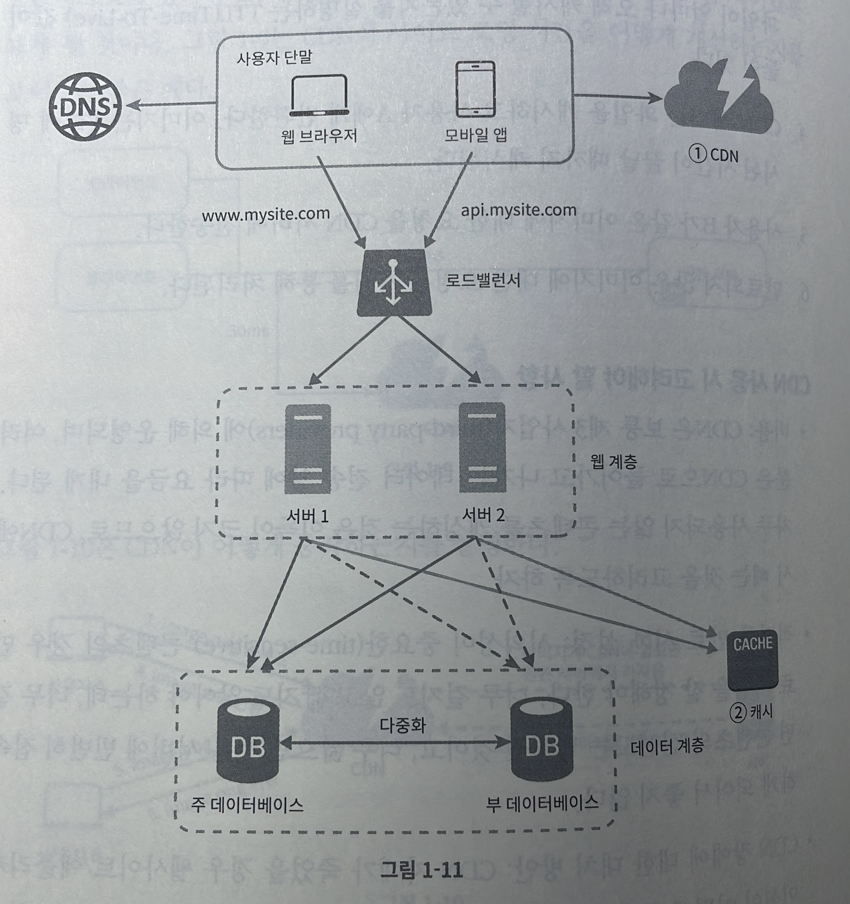

# 단일 서버

### 단일 서버에서의 통신 과정 

1. 사용자는 도메인 이름을 이용하여 웹사이트에 접속한다. 이 접속을 위해서는 DNS(Domain Name Service)에 질의하여 IP 주소로 변환하는 과정이 필요하다.
2. DNS 조회 결과로 실제 도메인 주소의 IP 주소를 반환된다. 
3. 반환된 IP 주소로 HTTP 요청이 전달된다.
4. 웹 서버는 요청을 받아 데이터베이스에서 CRUD 연산을 수행한다.
5. 요청을 수행했다면 결과 값으로 HTML 페이지나 JSON 형태의 응답을 반환한다.

사용자가 늘게 되면 하나의 서버로는 사용자의 요청을 처리하기에 어려움이 있다. 따라서 웹서버와 데이터베이스 서버를 따로 두고 관리를 한다. 이렇게 둘을 분리하면 독립적으로 확장해 나갈 수 있기 때문에 확장에 유연한 설계를 가지게 된다.

### 데이터베이스의 종류
1. 관계형 데이터베이스(RDBMS) : 자료를 테이블과 컬럼으로 표현하며, SQL을 사용하면 여러 테이블에 있는 데이터를 관계에 따라 조인(join)하여 합칠 수 있다.
- **장점** : 관계성을 가진 데이터들에 사용하기에 적합하다. 다양한 조건으로 검색이 가능하며, 외래키를 사용하여 조인 연산을 할 수 있다.
- **단점** : 스키마 변경이 어렵고, 수직적 확장은 가능하지만 수평적 확장은 어렵다.

2. 비 관계형 데이터베이스(NoSQL) : NoSQL은 네 가지로 나눌 수 있다. 키-값 저장소(key-value store), 그래프 저장소(graph store), 컬럼 저장소(column store), 문서 저장소(document store). NoSQL은 일반적으로 조인 연산은 지원하지 않는다.
- **장점** : 응답 지연시간(latency)이 낮다, 수평적 확장에 용이하다, 스키마를 동적으로 변경할 수 있다.
- **단점** : 데이터의 일관성이 지켜지지 않는 문제가 생길 수 있다, 복잡한 쿼리처리와 조인이 제한적이다.
- NoSQL을 선택하는 것이 바람직한 경우
  - 아주 낮은 응답 지연시간이 요구됨
  - 다루는 데이터가 비정형이라 관계형 데이터가 아님
  - 데이터를 직렬화하거나 역직렬화 할 수 있기만 하면 됨
  - 아주 많은 양의 데이터를 저장할 필요가 있음

### 수직적 확장 VS 수평적 확장

**수직적 확장(scale up)**
서버에 고사양 자원(더 좋은 CPU, 더 많은 RAM등)을 추가하는 행위를 말한다.
- 장점 : 단순함. 고사양의 부품으로 교체만 하면 된다.
- 단점 : 하나의 서버에 CPU나 메모리를 무한대로 증설할 수 있는 방법은 없다. 하나의 서버로 이루어져있기 때문에 장애가 생긴다면 해당 서비스 전체가 먹통이 되버리는 상황이 발생한다.(SPOF, single point of failure)

**수평적 확장(scale out)**
동일한 사양의 서버 인스턴스를 추가하는 행위를 말한다.
- 장점 : 다중 서버 구조이므로 많은 트래픽을 분산시켜 안정적으로 처리가 가능하다. 하나의 서버에서 장애가 발생하더라도 다른 서버가 정상적으로 동작한다면 해당 서비스는 중단되지 않는다.
- 단점 : 단순하지 않은 구현. 여러 서버를 관리하고 모니터링 하는 추가적인 관리 작업이 필요하다.
- 데이터베이스의 수평적 확장, 샤딩(sharding)
  - 데이터베이스 인스턴스를 샤드라는 단위로 분할해 데이터를 저장하는 방식이다. 이때 해시함수를 사용하여 어떤 샤드에 데이터를 저장할 지 정하기 때문에 샤드들 간에 데이터 중복은 일어나지 않는다.
  - 샤딩 전략을 구현할 때 샤딩 키를 어떻게 정하느냐가 중요하다. 

수평적 확장을 할 경우, 여러 서버 인스턴스들에게 트래픽을 고르게 분산시키는 역할을 하는 개체가 필요하다.

### 로드밸런서

로드밸런서는 부하 분산 집합(load balancing set)에 속한 웹 서버들에게 트래픽 부하를 고르게 분산시키는 역할을 한다.

첫번째의 사진과 다르게 로드밸런서를 적용하면 웹 서버는 클라이언트의 접속을 직접 처리하지 않는다. 더 나은 보안을 위해, 서버 간 통신에는 사설 IP 주소가 이용된다. 사설 IP 주소는 같은 네트워크에 속한 서버 사이의 통신에만 쓰일 수 있는 IP 주소로, 인터넷을 통해서는 접근할 수 없다. 로드밸런서는 웹 서버와 통신하기 위해 바로 이 사설 주소를 이용한다.

위의 구조로 시스템이 설계된다면 얻을 수 있는 이점은 다음과 같다.
- 하나의 서버에서 장애가 발생하여도 다른 서버에서 요청을 처리할 수 있기에 서비스가 중단되는 일이 없다.
- 트래픽이 많이 몰리거나, 적거나 하는 경우에 인스턴스 갯수를 동적으로 설정할 수 있다.

웹 서버는 로드밸런서를 적용하여 어느 정도 트래픽을 분산 시켜 안정적으로 처리할 수 있게 되었지만, 여전히 데이터베이스는 단일 서버로서 장애 복구, 다중화를 지원하고 있지 않다.

### 데이터베이스 다중화

데이터베이스 서버 사이에 주(master)-부(slave) 관계를 설정하고 데이터 원본은 주 서버에, 사본은 부 서버에 저장하는 방식이다.
쓰기 연산(write operation)은 주 데이터베이스에서만 지원하며, 부 데이터베이스는 사본을 전달받고 읽기 연산(read operation)만을 지원한다.
대부분의 애플리케이션은 읽기 연산의 비중이 쓰기 연산보다 훨씬 높다. 따라서 통상 부 데이터베이스의 수가 주 데이터베이스의 수보다 많다.

데이터베이스 다중화의 장점
- 더 나은 성능 : 주-부 다중화 모델에서 모든 데이터 변경 연산은 주 데이터베이스 서버로만 전달되는 반면 읽기 연산은 부 데이터베이스 서버들로 분산된다. 병렬로 처리될 수 있는 질의(query)의 수가 늘어나므로 성능이 좋아진다. 기존의 하나였던 데이터베이스 서버에서 읽기 연산을 수행하는 부 데이터베이스 인스턴스의 갯수가 많아졌으므로, 동시에 병렬적으로 처리할 수 있는 스레드의 수가 늘어났기 때문에 응답 지연시간(latency)가 줄어들어 성능이 개선된다.
- 안정성(reliability) : 자연 재해 등의 이유로 데이터베이스 서버 가운데 일부가 파괴되어도 데이터는 보존될 것이다. 데이터를 지역적으로 떨어진 여러 장소에 다중화시켜 놓을 수 있기 때문이다. 한가지 사례로 카카오 데이터 센터에 화재가 발생하여 서비스가 중단되는 일이 발생한 적이 있다. 이 때 카카오에서는 시스템 다중화를 물리적으로 떨어진 위치에 해두었다면 서비스는 빠르게 복구될 수 있었을 것이다. 카카오는 이 화재사건을 이후로  모든 카카오 내의 전체 시스템을 다중화하는 작업을 완료하였다.[카카오 데이터센터 \(1\) 안전 운영 계획](https://www.kakaocorp.com/page/detail/10859)
- 가용성(availability) : 데이터를 여러 지역에 복제해 둠으로써, 하나의 데이터베이스 서버에 장애가 발생하더라도 다른 서버에 있는 데이터를 가져와 계속 서비스할 수 있게 된다.

### 캐시
캐시 : 값비싼 연산 결과, 자주 참조되는 데이터를 메모리 안에 두고, 뒤이은 요청이 보다 빨리 처리될 수 있도록 하는 저장소.

장점 : 캐시에 존재하는 데이터라면 데이터베이스를 호출하지 않고 메모리에 있는 데이터를 바로 내려주면 되기에 성능이 개선되며, 데이터베이스의 부하를 줄일 수 있고, 캐시 계층의 규모를 독립적으로 확장시키는 것이 가능하다.

**읽기 캐시 전략**
1. 클라이언트의 HTTP 요청을 웹서버가 받는다.
2. 캐시서버에 조회하려는 데이터가 있는지 확인한다.
3. 있다면 바로 응답을 반환하고 없다면 데이터베이스를 호출하여 응답을 반환한다.

위와 같은 순서로 웹서버와 데이터베이스 사이에서 역할을 수행한다.

캐시를 적용할 때 유의할 사항들
- 데이터 갱신보다 조회가 많이 발생하는 데이터라면 캐시를 적용하는 것이 바람직할 수 있다.
- 캐시 데이터는 메모리에 올라가는 휘발성이다. 따라서 영속적으로 보관할 데이터는 중요 데이터는 지속적 저장소(persistent data store)에 저장하여야 한다.
- 캐시 만료 정책을 잘 설정해야 한다. 너무 짧다면 효율이 떨어지고, 너무 길다면 원본과 차이가 날 가능성이 높아진다.
- 일관성을 잘 유지하여야 한다. 데이터베이스의 갱신과 캐시서버의 데이터의 갱신이 단일 트랜잭션으로 처리되지 않는다면 일관성이 떨어진다.
- 캐시서버를 하나만 둔다면 단일 장애 지점(SPOF)이 되버린다. 따라서 캐시서버도 다중화를 하여 분산시켜야 한다.
- 캐시 메모리의 크기는 과할당(overprovision) 하는 것이 좋다. 너무 작게 설정하면 캐시에서 밀려나 성능이 떨어진다.
- 데이터 방출(eviction) 정책을 고민해야 한다. 자주 쓰이는 방식으로는 마지막 참조가 오래된 것을 기준으로 쓰이는 LRU, 참조된 횟수가 적은 것을 기준으로 쓰이는 LFU, 선입선출 구조인 FIFO 등이 있다.

### 컨텐츠 전송 네트워크(CDN)
CDN은 정적 컨텐츠를 전송하는 지리적으로 분산된 서버의 네트워크이다.
CDN은 CSS, JavaScript, Image, Video 등 다양한 정적파일을 캐시한다.

다음은 CDN이 정적 컨텐츠 요청에 응답하는 과정이다.
1. 클라이언트가 image 요청을 보낸다.
2. CDN은 요청받은 image가 있다면 반환을 하고, 아니라면 서버에서 image를 받아와 CDN에 저장하고 사용자에게 반환한다.
3. 다음 사용자의 image 요청이 오는 시점에는 CDN에 image 가 있기 때문에 바로 반환할 수 있다.

캐시된 이미지에는 TTL(Time-To-Live)가 있고, 명시된 시간까지만 캐시하여 사용할 수 있다.
CDN을 사용하면 지리적으로 멀리 떨어진 곳이라도 응답시간(latency)를 낮출 수 있다.

1. 클라이언트의 요청에서 필요한 정적파일들을 CDN에서 가져오기 때문에 더 나은 성능을 보여준다.
2. 캐시를 사용하여 필요한 데이터가 캐시에 있을 경우 데이터베이스 호출이 일어나지 않는다.

### 무상태(stateless) 웹 계층
책에서는 **수평적 확장**을 하기 위해선 상태정보를 웹 계층에서 제거하여야 한다고 한다. 아래는 상태 정보를 기억하고 있을 때 문제가 될만한 예시들을 생각해보았다.

상태 정보를 기억하는 예시
- 로그인 : 로그인 정보를 세션으로 관리를 하게 된다면 로드밸런서를 사용하여 사용자는 항상 같은 서버로 접속을 하게 고정 세션(sticky session)을 사용해야 하거나, 서버 인스턴스들 사이에 세션을 클러스터링 해야 한다. JWT 를 적용하면 서버에서는 토큰에 대한 검증만 하면 되기 때문에 상태 정보를 기억하지 않아도 된다.
- 소켓 통신 : 소켓 연결된 클라이언트의 정보를 하나의 서버 인스턴스에서 기억하고 있다면, 다른 인스턴스로 메시지를 발행하거나 구독을 요청하게 되면 서버에서는 이를 처리할 수 없다. 따라서 **메시지 큐**를 사용하여 중간에서 메시지를 적절히 분배해주는 매개체가 필요하다.
- 파일 업로드/다운로드 : 사용자가 업로드한 파일을 특정 서버의 로컬 디스크에 저장하면, 그 파일에 접근하기 위해서는 항상 같은 서버로 연결되어야 한다. 이를 해결하기 위해서는 파일을 중앙 스토리지(예: S3, NAS)에 저장하는 것이 좋다.
- 캐시 : 캐시 데이터를 로컬 서버 메모리에 저장하면, 다른 서버 인스턴스에서는 그 데이터를 사용할 수 없다. 이를 해결하기 위해서는 분산 캐시 시스템(예: Redis, Memcached)을 사용하는 것이 좋다.

**수평적 확장을 위해서 상태 정보가 없어야 하는 이유**
- 상태 정보가 없으면 어떤 서버 인스턴스든 클라이언트의 요청에 대해 동일하게 처리할 수 있기 때문에 서버 인스턴스 갯수를 트래픽이 몰리는 시점에 유연하게 늘리고 줄이는 것이 가능하다.

### 데이터 센터
클라이언트의 요청에 대해서 응답시간(latency)을 낮추기 위해선 데이터센터를 두어 클라이언트의 지리적 위치에서 가까운 데이터센터에서 데이터를 가져와야 한다. 이렇게 사용자의 지리적위치에 따라 데이터센터를 연결하는 방법을 지리적 라우팅(geoDNS-routing 또는 geo-routing)이라고 한다.

**장점** : 하나의 데이터 센터가 장애가 생겨도 다른 데이터센터는 정상적이라면 트래픽은 정상적인 데이터센터로 오게 만들면 서비스는 중단되지 않는다.

**유의점**
- 트래픽 우회 : 지리적으로 효과적인 경로를 찾아 라우팅을 해야한다. geoDNS는 사용자에게서 가장 가까운 데이터센터로 트래픽을 보낼 수 있도록 해준다.
- 데이터 동기화 : 데이터센터마다 별도의 데이터베이스를 사용하고 있다면 A 데이터센터가 장애가 발생되어 트래픽이 B 데이터센터로 가게 된다 하더라도, B 데이터센터에는 찾고자 하는 데이터가 없을 가능성이 있다. 이를 막기 위해선 데이터센터에 걸쳐 다중화를 시켜야 한다.
- 테스트와 배포 : 자동화된 배포 도구는 모든 데이터 센터에 동일한 서비스가 설치되도록 하는 데 중요한 역할을 한다.

### 메시지 큐
생산자와 소비자 또는 발행자와 구독자가 메시지를 생산하고 소비하는 방식으로 동작하는 비동기 통신을 지원하는 컴포넌트.
- 생산자는 해야할 일을 메시지 큐에 보낸다.
- 소비자는 자신이 처리해야할 작업을 메시지 큐에서 꺼내어 수행하게 된다.

이 방식은 비동기적으로 처리되어야할 작업에 대해서 용이하며, 서비스에 기능들 사이에 결합이 느슨해져 규모 확장성이 보장되어야 하는 안정적 애플리케이션을 구성하기에 좋다.

### 로그, 메트릭 그리고 자동화

**로그**
중앙 집중식 로깅 : 모든 서버의 로그들을 하나의 중앙 저장소에서 처리하는 방식
- 장점
  - 중앙 집중 관리 하기 때문에 로그 조회, 분석이 쉽다.
  - 여러 서버에서 생성된 로그를 처리하는 것이기에 서버 인스턴스가 늘어나도 확장에 문제 없다.
  - 중앙에서 로그를 관리함으로 문제 발생 시 모니터링 및 알림에 용이하다.
  - 로그를 중앙에서 관리함으로 로그 데이터의 무결성을 보장한다.
- 예시
  - ELK(ElastickSearch, Logstash, Kibana) : Logstash가 로그를 수집하고, ElastickSearch가 로그를 저장하며, Kibana가 이를 시각화해주는 보편적으로 많이 사용되는 기술 조합.

**메트릭**
시스템의 성능, 상태 동작을 측정하고 평가하는 데 사용되는 데이터.

- 호스트 단위 메트릭 : CPU, 메모리, 디스크 I/O에 관한 메트릭.
- 종합(aggregated) 메트릭 : 데이터베이스 계층의 성능, 캐시 계층의 성능 같은 것.
- 핵심 비즈니스 메트릭 : 일별 능동 사용자, 수익, 재방문 같은 것.
- 프로메테우스(Prometheus), 그라파나(Grafana) 등이 메트릭을 수집, 저장, 분석하는 데에 사용되는 툴이다.

**자동화**
CI/CD(Continuous Integration/ Continuous Deployment)는 개발 과정에서 일어나는 통합, 배포 과정을 자동화 하는 것을 뜻한다. CI는 개발자가 작성한 코드가 프로덕션 코드에 자동화되어 통합되는 것을 뜻하고, CD는 프로덕션 코드가 배포되는 과정을 자동화 한 것을 이야기 한다.

