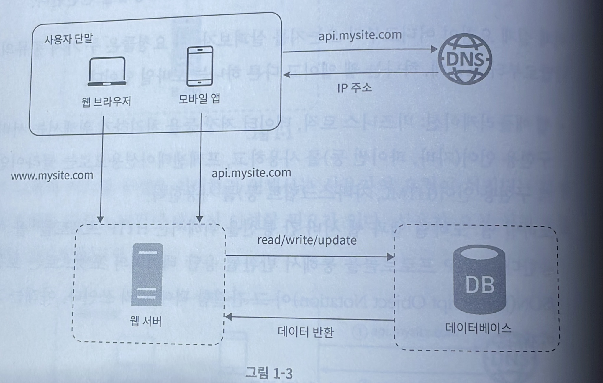
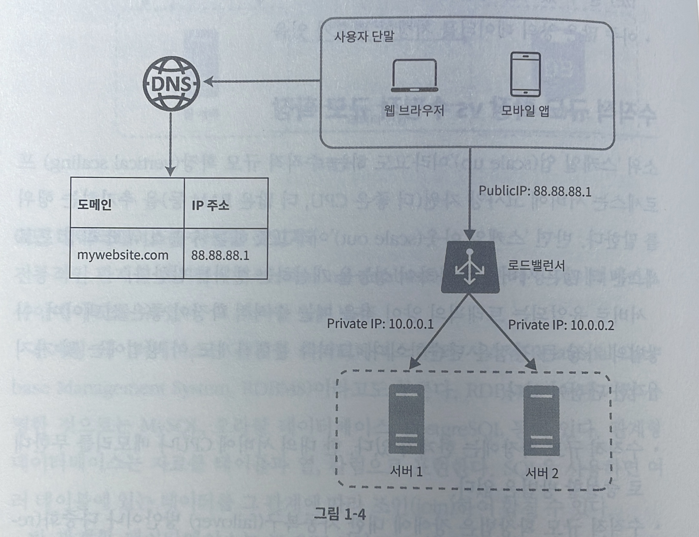
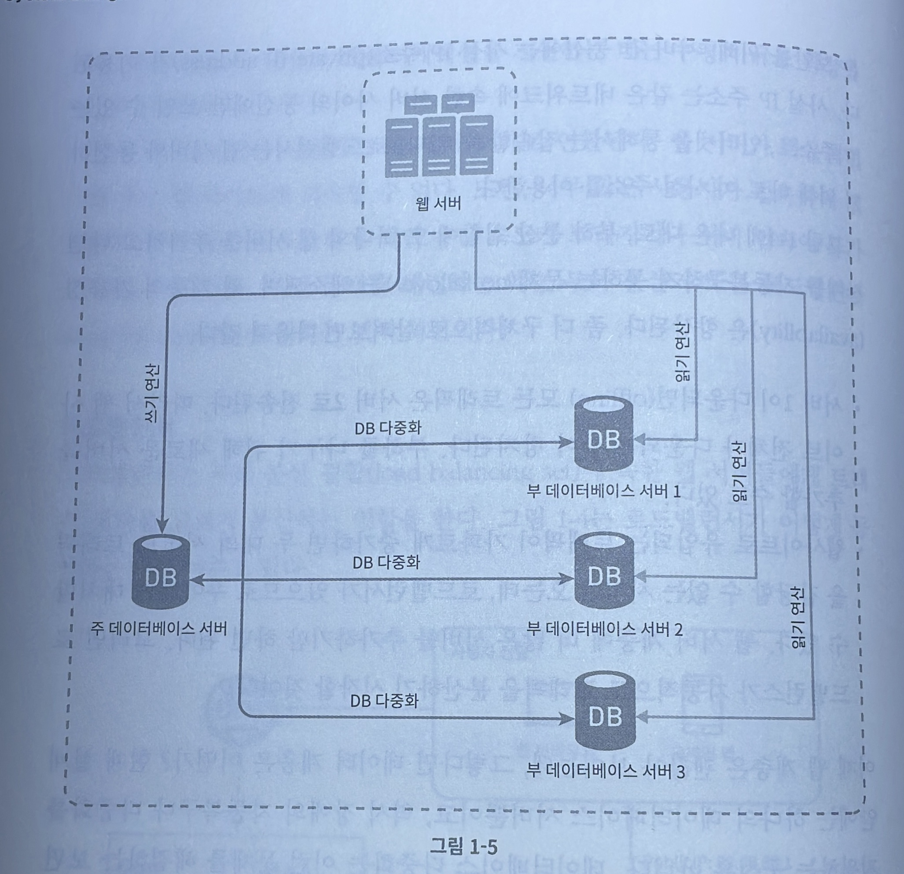

# 단일 서버

### 단일 서버에서의 통신 과정 

1. 사용자는 도메인 이름을 이용하여 웹사이트에 접속한다. 이 접속을 위해서는 DNS(Domain Name Service)에 질의하여 IP 주소로 변환하는 과정이 필요하다.
2. DNS 조회 결과로 실제 도메인 주소의 IP 주소를 반환된다. 
3. 반환된 IP 주소로 HTTP 요청이 전달된다.
4. 웹 서버는 요청을 받아 데이터베이스에서 CRUD 연산을 수행한다.
5. 요청을 수행했다면 결과 값으로 HTML 페이지나 JSON 형태의 응답을 반환한다.

사용자가 늘게 되면 하나의 서버로는 사용자의 요청을 처리하기에 어려움이 있다. 따라서 웹서버와 데이터베이스 서버를 따로 두고 관리를 한다. 이렇게 둘을 분리하면 독립적으로 확장해 나갈 수 있기 때문에 확장에 유연한 설계를 가지게 된다.

### 데이터베이스의 종류
1. 관계형 데이터베이스(RDBMS) : 자료를 테이블과 컬럼으로 표현하며, SQL을 사용하면 여러 테이블에 있는 데이터를 관계에 따라 조인(join)하여 합칠 수 있다.
- **장점** : 관계성을 가진 데이터들에 사용하기에 적합하다. 다양한 조건으로 검색이 가능하며, 외래키를 사용하여 조인 연산을 할 수 있다.
- **단점** : 스키마 변경이 어렵고, 수직적 확장은 가능하지만 수평적 확장은 어렵다.

2. 비 관계형 데이터베이스(NoSQL) : NoSQL은 네 가지로 나눌 수 있다. 키-값 저장소(key-value store), 그래프 저장소(graph store), 컬럼 저장소(column store), 문서 저장소(document store). NoSQL은 일반적으로 조인 연산은 지원하지 않는다.
- **장점** : 응답 지연시간(latency)이 낮다, 수평적 확장에 용이하다, 스키마를 동적으로 변경할 수 있다.
- **단점** : 데이터의 일관성이 지켜지지 않는 문제가 생길 수 있다, 복잡한 쿼리처리와 조인이 제한적이다.
- NoSQL을 선택하는 것이 바람직한 경우
  - 아주 낮은 응답 지연시간이 요구됨
  - 다루는 데이터가 비정형이라 관계형 데이터가 아님
  - 데이터를 직렬화하거나 역직렬화 할 수 있기만 하면 됨
  - 아주 많은 양의 데이터를 저장할 필요가 있음

### 수직적 확장 VS 수평적 확장

**수직적 확장(scale up)**
서버에 고사양 자원(더 좋은 CPU, 더 많은 RAM등)을 추가하는 행위를 말한다.
- 장점 : 단순함. 고사양의 부품으로 교체만 하면 된다.
- 단점 : 하나의 서버에 CPU나 메모리를 무한대로 증설할 수 있는 방법은 없다. 하나의 서버로 이루어져있기 때문에 장애가 생긴다면 해당 서비스 전체가 먹통이 되버리는 상황이 발생한다.(SPOF, single point of failure)

**수평적 확장(scale out)**
동일한 사양의 서버 인스턴스를 추가하는 행위를 말한다.
- 장점 : 다중 서버 구조이므로 많은 트래픽을 분산시켜 안정적으로 처리가 가능하다. 하나의 서버에서 장애가 발생하더라도 다른 서버가 정상적으로 동작한다면 해당 서비스는 중단되지 않는다.
- 단점 : 단순하지 않은 구현. 여러 서버를 관리하고 모니터링 하는 추가적인 관리 작업이 필요하다.

수평적 확장을 할 경우, 여러 서버 인스턴스들에게 트래픽을 고르게 분산시키는 역할을 하는 개체가 필요하다.

### 로드밸런서

로드밸런서는 부하 분산 집합(load balancing set)에 속한 웹 서버들에게 트래픽 부하를 고르게 분산시키는 역할을 한다.

첫번째의 사진과 다르게 로드밸런서를 적용하면 웹 서버는 클라이언트의 접속을 직접 처리하지 않는다. 더 나은 보안을 위해, 서버 간 통신에는 사설 IP 주소가 이용된다. 사설 IP 주소는 같은 네트워크에 속한 서버 사이의 통신에만 쓰일 수 있는 IP 주소로, 인터넷을 통해서는 접근할 수 없다. 로드밸런서는 웹 서버와 통신하기 위해 바로 이 사설 주소를 이용한다.

위의 구조로 시스템이 설계된다면 얻을 수 있는 이점은 다음과 같다.
- 하나의 서버에서 장애가 발생하여도 다른 서버에서 요청을 처리할 수 있기에 서비스가 중단되는 일이 없다.
- 트래픽이 많이 몰리거나, 적거나 하는 경우에 인스턴스 갯수를 동적으로 설정할 수 있다.

웹 서버는 로드밸런서를 적용하여 어느 정도 트래픽을 분산 시켜 안정적으로 처리할 수 있게 되었지만, 여전히 데이터베이스는 단일 서버로서 장애 복구, 다중화를 지원하고 있지 않다.

### 데이터베이스 다중화

데이터베이스 서버 사이에 주(master)-부(slave) 관계를 설정하고 데이터 원본은 주 서버에, 사본은 부 서버에 저장하는 방식이다.
쓰기 연산(write operation)은 주 데이터베이스에서만 지원하며, 부 데이터베이스는 사본을 전달받고 읽기 연산(read operation)만을 지원한다.
대부분의 애플리케이션은 읽기 연산의 비중이 쓰기 연산보다 훨씬 높다. 따라서 통상 부 데이터베이스의 수가 주 데이터베이스의 수보다 많다.

데이터베이스 다중화의 장점
- 더 나은 성능 : 주-부 다중화 모델에서 모든 데이터 변경 연산은 주 데이터베이스 서버로만 전달되는 반면 읽기 연산은 부 데이터베이스 서버들로 분산된다. 병렬로 처리될 수 있는 질의(query)의 수가 늘어나므로 성능이 좋아진다. 기존의 하나였던 데이터베이스 서버에서 읽기 연산을 수행하는 부 데이터베이스 인스턴스의 갯수가 많아졌으므로, 동시에 병렬적으로 처리할 수 있는 스레드의 수가 늘어났기 때문에 응답 지연시간(latency)가 줄어들어 성능이 개선된다.
- 안정성(reliability) : 자연 재해 등의 이유로 데이터베이스 서버 가운데 일부가 파괴되어도 데이터는 보존될 것이다. 데이터를 지역적으로 떨어진 여러 장소에 다중화시켜 놓을 수 있기 때문이다. 한가지 사례로 카카오 데이터 센터에 화재가 발생하여 서비스가 중단되는 일이 발생한 적이 있다. 이 때 카카오에서는 시스템 다중화를 물리적으로 떨어진 위치에 해두었다면 서비스는 빠르게 복구될 수 있었을 것이다. 카카오는 이 화재사건을 이후로  모든 카카오 내의 전체 시스템을 다중화하는 작업을 완료하였다.[카카오 데이터센터 \(1\) 안전 운영 계획](https://www.kakaocorp.com/page/detail/10859)
- 가용성(availability) : 데이터를 여러 지역에 복제해 둠으로써, 하나의 데이터베이스 서버에 장애가 발생하더라도 다른 서버에 있는 데이터를 가져와 계속 서비스할 수 있게 된다.

